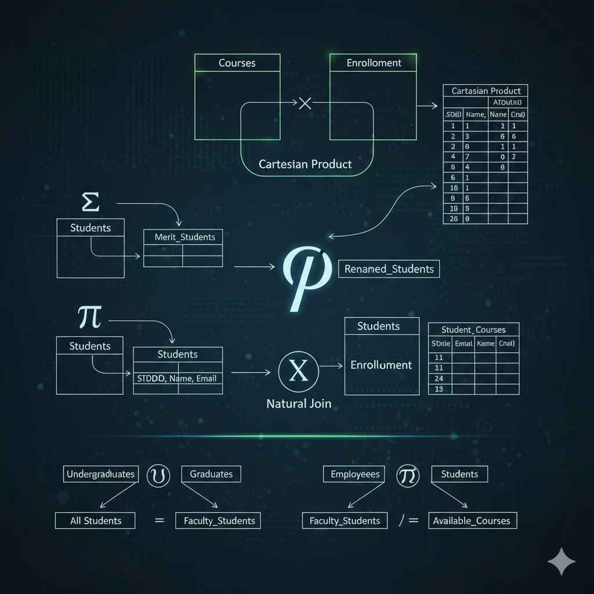

# 🗂️ Практична робота №5 — Створення логічної моделі

## 📄 Опис
Ця практична робота призначена для закріплення навичок проєктування та нормалізації баз даних за допомогою **CA ERWin Data Modeler** або іншого Case-засобу. У рамках роботи потрібно створити логічну модель бази даних, згенеровано SQL-скрипти для реалізації структури бази даних у цільовій СУБД та забезпечено відповідність моделі нормальним формам (1NF, 2NF, 3NF, BCNF).

## 🎯 Мета роботи
Навчитися працювати з CASE-засобом **CA ERWin Data Modeler** або іншого Case-засобу для створення та документування баз даних. Опанувати методи нормалізації та генерації SQL-скриптів для СУБД, що відповідає вимогам лабораторної роботи №5.

## 🗃️ Структура бази даних
Проєктована база даних містить такі основні сутності:
- **Employee** — містить інформацію про співробітників.
- **Position** — описує посади та базові зарплати.
- **Allowance** — містить надбавки та їхні описи.
тощо...

## 📊 Діаграма ER-моделі
Нижче представлена діаграма ER-моделі, створена в **CA ERWin Data Modeler**:

## 📝 Генерація SQL-схеми
Скріншот згенерованої SQL-схеми для таблиць бази даних у **DB2/UDB**:

## ⚙️ Генерація SQL-скриптів
У **CA ERWin Data Modeler** були згенеровані SQL-скрипти для створення бази даних у цільовій СУБД. Ці скрипти забезпечують автоматичне створення всіх необхідних таблиць, ключів та зв'язків, відповідно до проєктованої моделі.

## ✅ Висновок
У процесі виконання лабораторної роботи було успішно створено логічну та фізичну моделі бази даних, забезпечено відповідність нормальним формам та отримано SQL-скрипти для цільової СУБД.
